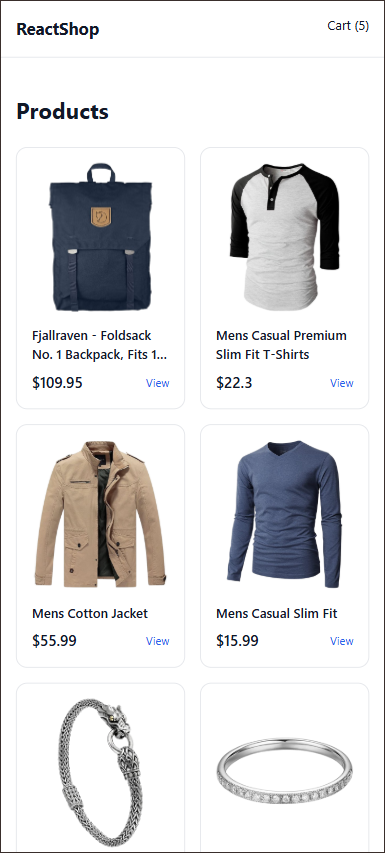
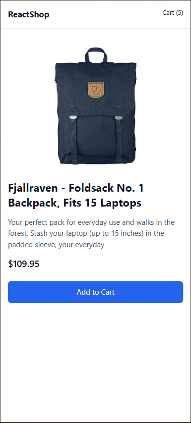
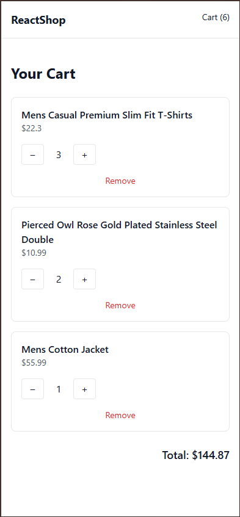
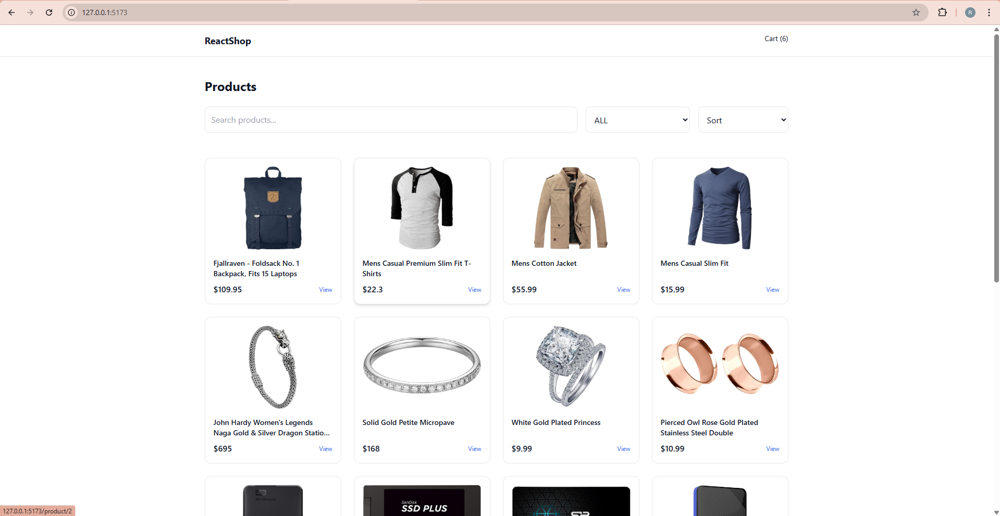
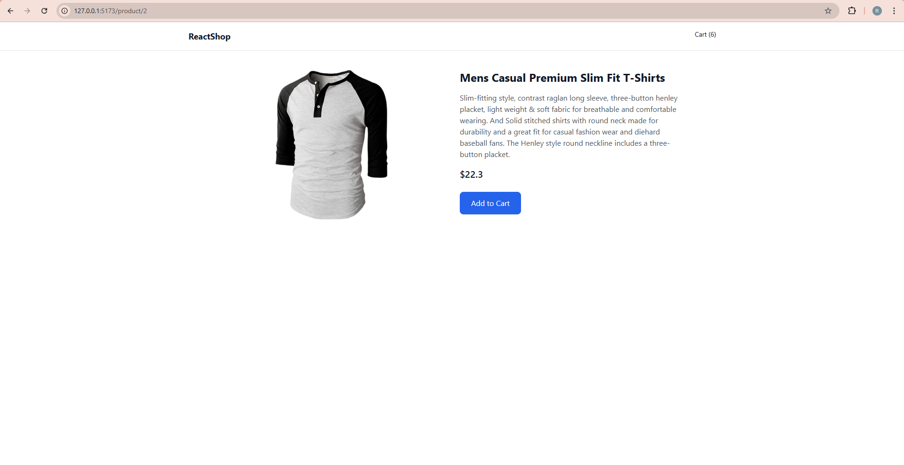
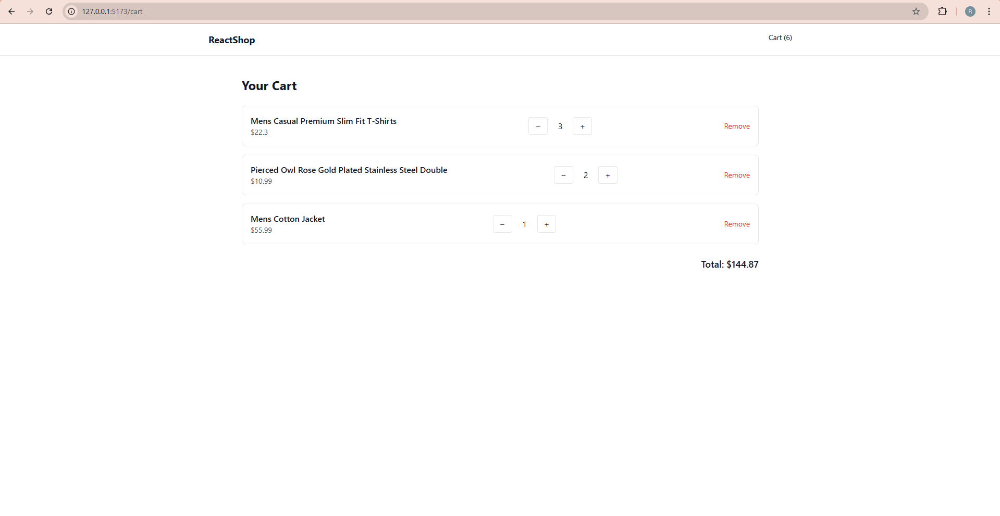

# React E-Commerce Store 🛒

A modern, responsive e-commerce frontend built with React.  
This project demonstrates real-world frontend skills such as API integration, global state management, and mobile-first UI design.

---

## 🚀 Live Demo
👉 https://ecommerce-two-psi-57.vercel.app/

---

## 🧠 Features
- Product listing with live API data
- Product details page with skeleton loader
- Search, category filtering, and sorting
- Shopping cart with quantity controls
- Persistent cart using localStorage
- Global state management with Context API
- Skeleton loaders for improved perceived performance
- Loading and error handling
- Fully responsive, mobile-first UI

---

## 🛠 Tech Stack
- React
- Vite
- Tailwind CSS
- React Router
- Context API
- Fake Store API

---
## 📸 Screenshots
  
  
  

  
  
  

---

## 📂 Project Structure
```text
src/
├── components/
├── pages/
├── context/
├── App.jsx
  ```
---

## ⚙️ Installation & Setup

```bash
git clone https://github.com/yanorenzo624/ecommerce.git
cd ecommerce
npm install
npm run dev
```

---

## 🎯 What I Learned
- Managing complex global state with React Context
- Implementing client-side search, filter, and sort logic
- Persisting application state using localStorage
- Improving UX with skeleton loaders and responsive layouts
- Building scalable and reusable React components

---

## 📬 Contact
- Portfolio: https://
- GitHub: https://github.com/yanorenzo624
- Gmail: yanorenzo624@gmail.com

---
